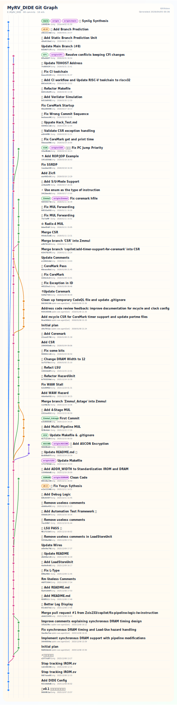

# GitVision

GitVision is a zero-dependency Node.js project that reads a Git repository, computes branch lanes, and exports a polished static graph in SVG or HTML.

The first implementation targets the workflow you described:

- Parse commit history from `git log --all`
- Visualize branches, merges, and refs like a Git Graph view
- Export a static artifact that looks presentation-ready
- Work directly against a local repository such as `E:\MyRV_DIDE` (`https://github.com/zxis233/EsCute-RV.git`)

## Usage

Render the default SVG export:

```bash
node src/cli.js render E:\MyRV_DIDE
```

Render to a custom file:

```bash
node src/cli.js render E:\MyRV_DIDE -o out\escute-rv.svg --title "EsCute-RV Git Graph"
```

Export an HTML wrapper instead of raw SVG:

```bash
node src/cli.js render E:\MyRV_DIDE --format html -o out\escute-rv.html
```

Limit the number of commits:

```bash
node src/cli.js render E:\MyRV_DIDE --max-commits 120
```

Keep a selected branch on the first-parent lane:

```bash
node src/cli.js render E:\MyRV_DIDE --main-branch main
```

Only include recent commits:

```bash
node src/cli.js render E:\MyRV_DIDE --since-days 365
```

## GitHub Actions

This repository includes a manual workflow at `.github/workflows/render-git-graph.yml`.

It exposes three inputs:

- `repository_url`: target Git repository URL, or GitHub shorthand like `owner/repo`
- `main_branch`: branch to keep on lane 0 as the first-parent chain
- `extra_args`: extra render flags such as `--max-commits 100 --since-days 365`

The workflow will:

- clone the target repository
- optionally use the `REPO_READ_PAT` secret when accessing GitHub-hosted private repositories
- render a single output file
- upload that file directly as a single-file artifact without zipping when the workflow runs on `actions/upload-artifact@v7`

Generated files follow this naming pattern:

```text
{User}-{Repo}_{Branch}_{parameters}.svg
```

Typical parameter slugs are compact, for example `mc100-d365`, `mc200-html`, or `mc100-d30-tWeekly-Export`.

If `--format html` is passed through `extra_args`, the extension becomes `.html`.

## Project Structure

- `src/git-data.js`: collect commits and refs from Git
- `src/layout.js`: assign visual lanes and build edges
- `src/render.js`: render the final SVG/HTML
- `src/cli.js`: command-line entry point
- `scripts/render-workflow.js`: helper used by the manual GitHub Actions workflow
- `test/render.test.js`: end-to-end smoke tests
- `test/workflow-script.test.js`: workflow helper unit tests

## Examples

Based on [Escute-RV](https://github.com/Zxis233/EsCute-RV)


